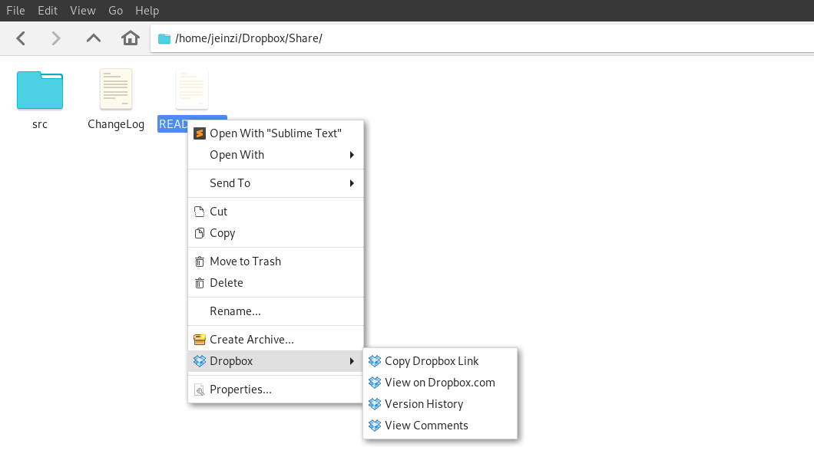

# Thunar-Dropbox

Thunar-Dropbox is a plugin for Thunar that adds context-menu items from 
Dropbox. It was originally developed by [Maato](https://github.com/Maato/thunar-dropbox).

## Installation
### Dependencies
Depending on your distribution you might have to install `libthunarx-3`.

### From a repository
The plugin is available in the repositories of most distributions, check it out here:

### From source
    cmake -B build -DCMAKE_BUILD_TYPE=Release -DCMAKE_INSTALL_PREFIX:PATH=/usr/lib .
    cmake --build build

The first call to cmake configures the build system. The -B flag specifies the output directory, here _build_. The dot at the end is the path to the directory containing _CMakeLists.txt_.  
`DCMAKE_INSTALL_PREFIX` sets the installation directory and might be unnecessary on your distribution, or you might need to set it to some other path.

The second call actually compiles the project into the build directory.
Afterwards, you can execute

    cmake --build build --target install --config Release

to install it to the proper directories.